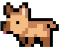

  

<h1 align="center">
  Gabriela Scofield
</h1>

 
Hi! I'm a Software Developer currently graduating in <b> Control and Automation Engineering</b>.

  

<b> Academic Situation:</b> 4th semester

  
<h3 align="center">Languages and Tools:</h3>
 

 
  
  
  
  
  
  
   </a>
  
  

